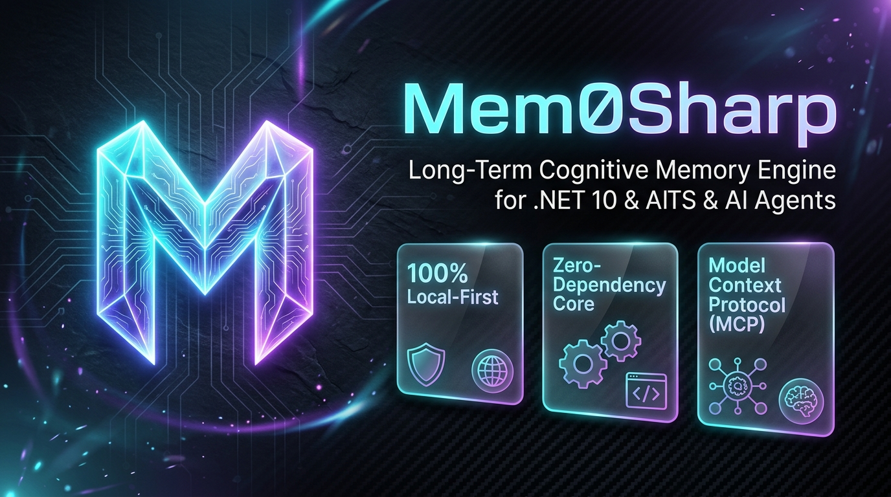
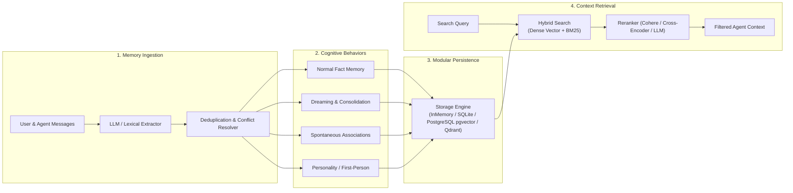

<div align="center">
  
</div>

# Mem0Sharp

[](https://www.nuget.org/packages/Mem0Sharp)
[](https://www.nuget.org/packages/Mem0Sharp)
[](https://github.com/jihadkhawaja/mem0sharp/releases)
[](https://dotnet.microsoft.com/download/dotnet/10.0)
[](LICENSE)

**Long-term cognitive memory engine for AI applications and agents in .NET 10.**

Mem0Sharp is an independent, standalone C#/.NET implementation of the open-source [Mem0 project](https://github.com/mem0ai/mem0). It delivers a unified service API for saving, searching, updating, and consolidating semantic memories with modular embedding and vector storage providers.

- 🔒 **100% Standalone & Local-First**: Runs entirely in-process in .NET with zero telemetry or third-party cloud service requirements.
- 🪶 **Zero-Dependency Core**: Core runtime uses standard .NET 10 BCL. Persistence providers (PostgreSQL/pgvector, SQLite, Qdrant) are modular add-ons.
- 🧠 **Cognitive Memory Behaviors**: Goes beyond raw vector storage with autonomous behaviors (dreaming/consolidation, spontaneous associations, and personality-shaped first-person recall).
- 🔌 **Native Model Context Protocol (MCP)**: Includes 9 local MCP tools out of the box for agentic developer tools (Cursor, Claude Desktop, Copilot).

*Mem0Sharp is not affiliated with, sponsored by, or endorsed by Mem0 or mem0ai.*

---

## 5-Line Quickstart

Get started immediately with zero external databases or API keys:

```csharp
using Mem0Sharp;

var memory = new MemoryService(new InMemoryMemoryStore(), new LocalEmbeddingGenerator(384));
await memory.AddAsync("I prefer C# over Python.", userId: "alice");
var results = await memory.SearchAsync("What language does Alice like?", new MemoryFilter(UserId: "alice"));

Console.WriteLine(results[0].Memory.Text); // Outputs: I prefer C# over Python.
```

---

## Why Mem0Sharp? (Comparison Matrix)

| Feature / Capability | **Mem0Sharp** | Python Mem0 (OSS) | Hosted Mem0 SaaS | Raw Vector DBs | Ephemeral Chat Buffers |
| :--- | :---: | :---: | :---: | :---: | :---: |
| **Ecosystem & Runtime** | **Native .NET 10 / C#** | Python | Cloud API | Any Driver | Any Framework |
| **Local-First & Offline** | **100% (No Telemetry)** | 100% | ❌ Cloud Only | 100% | 100% |
| **Zero-Dependency Core** | **Yes (Pure .NET BCL)** | ❌ Multi-package | ❌ Client SDK | ❌ Heavy client | Yes |
| **Cognitive Behaviors** *(Dreaming, Identity)* | **Built-in** | ❌ (Static) | ❌ (Static) | ❌ (Raw vectors) | ❌ |
| **Model Context Protocol (MCP)** | **9 Built-in Tools** | Separate repo | ❌ Cloud only | ❌ | ❌ |
| **Hybrid Search + Cross-Encoder Reranking** | **Built-in (BM25 + Dense)** | Basic | Proprietary | ❌ Manual setup | ❌ |
| **Audit History & Temporal Tracking** | **Built-in** | Basic | Proprietary | ❌ Manual setup | ❌ |

---

## Architecture & Memory Lifecycle



---

## Installation

Install the dependency-free core package:

```powershell
dotnet add package Mem0Sharp
```

For persistent database backends, install the optional provider packages:

```powershell
dotnet add package Mem0Sharp.PostgreSQL
dotnet add package Mem0Sharp.SQLite
```

---

## Features

- **Semantic & Hybrid Retrieval**: Dense vector search combined with BM25 keyword scoring and LLM/Cohere/Cross-Encoder reranking.
- **Model Support**: Built-in support for OpenAI-compatible, Anthropic, and Ollama model APIs.
- **Cognitive Behaviors**:
  - `Normal`: Standard factual extraction and recall.
  - `Dreaming`: Background memory consolidation, compressing repeated facts into long-term insights.
  - `Random Thoughts`: Spontaneous associations and creative prompt injections.
  - `Personal/Identity`: First-person perspective memory shaping.
- **Audit & History**: Persistent `ADD`, `UPDATE`, and `DELETE` history with audit timestamps, actor, and role tracking.
- **Scoped Organization**: User, session, and agent-level memory partitioning with run filters and metadata matching.
- **Model Context Protocol (MCP)**: 9 built-in tools ready to plug into Claude Desktop, Cursor, and VS Code.
- **Batch Operations**: High-throughput transactional batch embeddings and searches.

---

## Usage Examples

### 1. Basic In-Memory Operations

```csharp
using Mem0Sharp;

var memory = new MemoryService();

// Add a memory
await memory.AddAsync("I prefer dark mode and vim keybindings", userId: "alice");

// Search memories
var results = await memory.SearchAsync(
    "What editor settings does Alice prefer?",
    new MemoryFilter(UserId: "alice"),
    topK: 3);

foreach (var result in results)
{
    Console.WriteLine($"{result.Score:F3}: {result.Memory.Text}");
}

// Update and History
var allMemories = await memory.GetAllAsync(new MemoryFilter(UserId: "alice"));
var memoryId = allMemories[0].Id;
await memory.UpdateAsync(memoryId, "I prefer dark mode and Neovim keybindings");
var history = await memory.GetHistoryAsync(memoryId);
```

### 2. Multi-turn Conversation Extraction

```csharp
await memory.AddAsync(
[
    new Message("user", "I live in Berlin and work as a .NET architect."),
    new Message("assistant", "Nice to meet you! I will remember that.")
],
userId: "alice",
scope: MemoryScope.User);
```

### 3. Persistent PostgreSQL with pgvector

```csharp
using Mem0Sharp;

var embeddings = new LocalEmbeddingGenerator(384);
await using var store = new PostgresMemoryStore(new PostgresMemoryStoreOptions
{
    ConnectionString = Environment.GetEnvironmentVariable("MEM0_POSTGRES")!,
    EmbeddingDimensions = 384,
    TableName = "mem0_memories"
});
await store.InitializeAsync();

var memory = new MemoryService(store, embeddings);
```

### 4. Portable SQLite Store

```csharp
using Mem0Sharp;

await using var store = new SqliteMemoryStore("data/mem0sharp.db");
await store.InitializeAsync();

var memory = new MemoryService(store, new LocalEmbeddingGenerator(384));
```

---

## Ecosystem Integration & Samples

Explore practical runnable examples in the [`samples/`](samples/) folder:

- **[Getting Started](samples/GettingStarted/README.md)**: Zero-setup CRUD, search, and history tracking.
- **[Memory Behaviors](samples/MemoryBehaviors/README.md)**: Fact extraction, dreaming/consolidation, spontaneous associations, and personality-shaped memory.
- **[Ollama Integration](samples/Ollama/README.md)**: Fully offline local LLM extraction and embeddings.
- **[PostgreSQL + OpenAI](samples/PostgresOpenAI/README.md)**: Enterprise persistent pgvector storage with OpenAI models.
- **[Agent Framework Memory](samples/AgentFrameworkMemory/README.md)**: Cross-session persistent memory for Microsoft Agent Framework.
- **[MCP Server](samples/McpServer/README.md)**: Standalone Model Context Protocol server exposing Mem0Sharp tools to Claude Desktop & Cursor.

---

## Documentation

- **Guides**: [Documentation Home](docs/README.md) | [Getting Started](docs/getting-started.md) | [Providers & Persistence](docs/providers-and-persistence.md)
- **Reference**: [API Reference](docs/api-reference.md) | [Mem0 Python Parity Guide](docs/mem0-python-parity.md)
- **Benchmarking**: [Evaluation Harness & Metrics](docs/evaluation.md)
- **Architecture**: [Architecture Overview](docs/architecture.md) | [Contribution Guidelines](CONTRIBUTING.md)

---

## Build & Test

```powershell
dotnet build .\Mem0Sharp.slnx
dotnet test .\tests\Mem0Sharp.Tests\Mem0Sharp.Tests.csproj
```

---

## Attribution and Trademarks

Mem0Sharp is an independent .NET implementation inspired by the open-source [Mem0 project](https://github.com/mem0ai/mem0). The original Mem0 project is copyright 2023 Taranjeet Singh and is licensed under the Apache License 2.0. Copyright for the Mem0Sharp implementation and its modifications is held by Jihad Khawaja and contributors. See [NOTICE](NOTICE) and [LICENSE](LICENSE) for details.

Mem0 and related marks belong to their respective owners. Mem0Sharp is not affiliated with, sponsored by, or endorsed by Mem0 or mem0ai.

