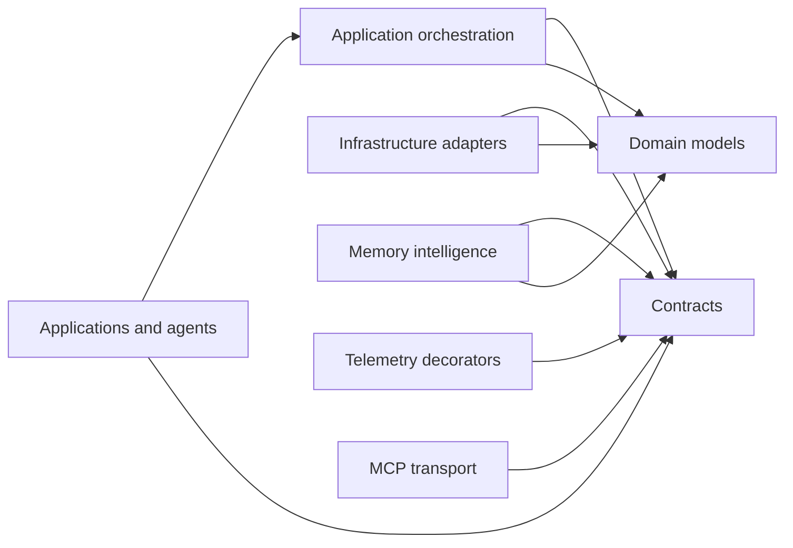

# Architecture

Mem0Sharp uses a pragmatic ports-and-adapters architecture inside one package. The public `Mem0Sharp` namespace remains stable, while the source tree separates domain types, contracts, application orchestration, and replaceable infrastructure.

Keeping one assembly preserves compatibility for existing consumers. The folders express ownership and dependency direction without requiring applications to reference several packages for the default experience.

## Dependency direction

Dependencies point toward contracts and domain models. Contracts never depend on application services or concrete infrastructure. `MemoryService` coordinates use cases through interfaces and does not contain provider-specific HTTP or database logic.

## Source layout

| Folder | Responsibility |
| --- | --- |
| `Domain` | Memory, filtering, search, relationship, history, and operation models. |
| `Contracts` | Storage, embedding, intelligence, telemetry, relationship, and service ports. |
| `Application` | Use-case orchestration, composition, and internal search policies. |
| `Infrastructure/InMemory` | Ephemeral store adapters used by the default service and tests. |
| `Infrastructure/Extraction` | Deterministic built-in extraction implementations. |
| `Infrastructure/Embeddings` | Deterministic local embedding implementations. |
| `Infrastructure/OpenAI` | OpenAI-compatible HTTP adapters. |
| `Infrastructure/Postgres` | PostgreSQL and pgvector persistence adapters. |
| `Intelligence` | Provider-neutral LLM extraction, conflict resolution, procedural memory, graph extraction, and reranking policies. |
| `Telemetry` | Telemetry decorators and collectors. |
| `Facades` | Alternative API façades, including the synchronous wrapper. |
| `Transports` | Protocol adapters such as the MCP JSON-RPC server. |

All public types currently remain in `namespace Mem0Sharp`. Folder names are architectural boundaries, not namespace segments, so this refactor does not require consumer source changes.

## Composition

`MemoryService` is the application service. It accepts ports such as `IMemoryStore`, `IEmbeddingGenerator`, and `IMemoryExtractor` through constructor injection. `MemoryServiceConfiguration` is the explicit composition root when optional capabilities such as telemetry, graph memory, conflict resolution, or reranking are enabled.

The parameterless `MemoryService` path composes deterministic in-memory defaults for local development. Production applications should compose persistent stores and model providers at their own startup boundary.

## Extension rules

1. Add provider-neutral data to `Domain` and provider-neutral behavior contracts to `Contracts`.
2. Keep orchestration in `Application`; application code may depend on contracts but not concrete adapters.
3. Put HTTP, database, filesystem, and vendor SDK code under `Infrastructure`.
4. Put model-driven memory policies under `Intelligence` when they depend only on provider-neutral contracts.
5. Put protocol concerns under `Transports` and cross-cutting decorators under their dedicated folder.
6. Preserve the public `Mem0Sharp` namespace unless a planned major version explicitly introduces namespace migration.

PostgreSQL is isolated at the source boundary but remains in the main package for compatibility. A future major version can extract it to an optional adapter package after adding shared store contract tests and a documented package migration path.