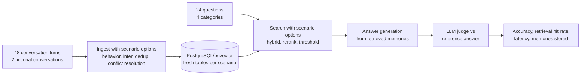

# Evaluation

Mem0Sharp ships with a runnable evaluation harness in [evaluation/](../evaluation/README.md) that measures how well the library stores and retrieves memories across its options and memory behaviors. It uses PostgreSQL/pgvector as the database and follows the ingest → search → answer → judge pipeline used by the LOCOMO benchmark in the [Mem0 evaluation suite](https://github.com/mem0ai/memory-benchmarks), with a self-contained fictional dataset so no download is required.

## Method



Each scenario ingests the same two multi-session conversations into fresh, scenario-scoped PostgreSQL tables, then evaluates 24 questions:

| Category | Questions | What it tests |
| --- | --- | --- |
| Single-hop | 8 | Recalling one stated fact |
| Multi-hop | 6 | Combining two or more facts |
| Temporal | 4 | Reasoning about how facts changed over time |
| Adversarial | 6 | Refusing to answer questions the conversations never cover |

**Accuracy (J-score)** is the share of answers judged CORRECT by an LLM judge against a reference answer, using the LOCOMO benchmark's unified judge rules: JSON verdicts with reasoning, partial credit for list answers, paraphrase and date tolerance (±14 days, durations within 50%), and semantic-overlap matching. Adversarial questions score CORRECT only when the system declines to guess. Alongside the judge score, the harness reports the answer-quality metrics used by popular memory evaluations: **token-level F1** and **BLEU-1** between the generated and reference answers. **Retrieval hit rate** is the share of answerable questions where at least one expected evidence string appears in the retrieved memories, which separates retrieval quality from answer-generation quality.

## Scenario matrix

| Scenario | What it varies |
| --- | --- |
| `baseline` | Default pipeline: LLM extraction, hybrid search, dedup on |
| `no-hybrid` | Semantic vector search only |
| `llm-rerank` | Adds `LlmReranker` |
| `conflict-resolution` | Adds `LlmMemoryConflictResolver` (ADD/UPDATE/DELETE/NONE decisions) |
| `no-dedup` | Deduplication off |
| `infer-off` | Raw message storage, no LLM extraction |
| `strict-threshold` | Search threshold raised to 0.3 |
| `behavior-dreaming` | Dreaming memory behavior |
| `behavior-random-thoughts` | Random-thoughts memory behavior |
| `behavior-personal-memory` | First-person persona-shaped memory behavior |

## Results

### LLM-judged scenario matrix (2026-08-09)

Full run against the composed PostgreSQL/pgvector database with `gpt-5-mini` for extraction, answering, and judging, and `text-embedding-3-small` (1536 dimensions) for embeddings. Judging follows the LOCOMO J-score methodology; F1 and BLEU-1 measure token overlap with the reference answer. Raw report (Markdown and JSON): [evaluation/results/evaluation-20260809-131747.md](../evaluation/results/evaluation-20260809-131747.md). Two scenarios had a small number of question-level provider errors (`no-hybrid`: 4 of 24, `behavior-dreaming`: 4 of 24); those questions are excluded from accuracy, which is computed over judged questions only.

| Scenario | Accuracy (J) | Mean F1 | Mean BLEU-1 | Retrieval hit rate | Memories | Mean search (ms) | Ingest (s) |
| --- | --- | --- | --- | --- | --- | --- | --- |
| baseline | 83% (20/24) | 0.44 | 0.26 | 100% | 39 | 326 | 124.2 |
| no-hybrid | 90% (18/20) | 0.48 | 0.32 | 83% | 40 | 376 | 119.5 |
| llm-rerank | 79% (19/24) | 0.42 | 0.24 | 83% | 34 | 27082 | 127.5 |
| conflict-resolution | 96% (23/24) | 0.48 | 0.29 | 100% | 41 | 387 | 215.1 |
| no-dedup | 75% (18/24) | 0.41 | 0.24 | 94% | 35 | 367 | 105.8 |
| infer-off | 96% (23/24) | 0.52 | 0.34 | 100% | 48 | 428 | 9.1 |
| strict-threshold | 75% (18/24) | 0.41 | 0.24 | 78% | 39 | 402 | 122.1 |
| behavior-dreaming | 95% (19/20) | 0.47 | 0.28 | 83% | 122 | 440 | 190.9 |
| behavior-random-thoughts | 54% (13/24) | 0.20 | 0.05 | 83% | 102 | 498 | 143.8 |
| behavior-personal-memory | 96% (23/24) | 0.52 | 0.34 | 100% | 54 | 744 | 147.9 |

Accuracy by category:

| Scenario | Single-hop | Multi-hop | Temporal | Adversarial |
| --- | --- | --- | --- | --- |
| baseline | 88% | 67% | 75% | 100% |
| no-hybrid | 100% | 80% | 50% | 100% |
| llm-rerank | 88% | 67% | 50% | 100% |
| conflict-resolution | 100% | 100% | 75% | 100% |
| no-dedup | 88% | 50% | 50% | 100% |
| infer-off | 100% | 100% | 75% | 100% |
| strict-threshold | 75% | 67% | 50% | 100% |
| behavior-dreaming | 88% | 100% | 100% | 100% |
| behavior-random-thoughts | 38% | 67% | 0% | 100% |
| behavior-personal-memory | 100% | 100% | 75% | 100% |

### Harness validation (2026-08-09)

The self-test run below validates the harness end to end against the composed PostgreSQL/pgvector database using the deterministic local provider (no LLM calls): 48 conversation turns were extracted, embedded, and persisted, and every answerable question retrieved at least one supporting memory.

| Scenario | Mode | Accuracy | Retrieval hit rate | Memories | Mean search (ms) |
| --- | --- | --- | --- | --- | --- |
| baseline | retrieval-only, deterministic local embeddings | n/a | 100% (18/18) | 48 | 5 |

## Reproducing and publishing results

To rerun the matrix:

```powershell
docker compose -f .\evaluation\compose.yaml up -d
Copy-Item .\evaluation\Mem0Sharp.Evaluation\evalconfig.example.yaml .\evaluation\Mem0Sharp.Evaluation\evalconfig.local.yaml
# add your API key to evalconfig.local.yaml, then:
dotnet run --project .\evaluation\Mem0Sharp.Evaluation\Mem0Sharp.Evaluation.csproj
```

The run writes Markdown and JSON reports next to the executable under `results/` (gitignored). To publish: copy both files into the committed [evaluation/results/](../evaluation/results/README.md) folder, then update the raw-report link above and the scenario summary and category tables, keeping the run date, model names, and mode from the report header. LLM extraction and judging are not perfectly deterministic; rerun before drawing conclusions from small differences.

## Interpreting the measured results

- **Adversarial accuracy is 100% in every scenario** — with retrieval scoped correctly, Mem0Sharp declines to answer questions the conversations never covered instead of hallucinating.
- **`conflict-resolution`, `infer-off`, and `personal-memory` tie at the top (96%)**, but for different reasons: conflict resolution produces cleaner, less contradictory facts at write time (best multi-hop at 100%), raw storage preserves full context at 15× faster ingest (9.1 s), and the persona-shaped behavior keeps first-person memories focused. `infer-off` gives up durable, deduplicated facts; prefer it when conversations are short and self-contained.
- **Hybrid search protects recall**: disabling it (`no-hybrid`) cut the retrieval hit rate to 83% — BM25 fusion helps names, places, and exact phrases. Its high judged accuracy over 20 questions should be read against the 4 errored questions and the lower hit rate.
- **`llm-rerank` did not pay off here**: it added ~27 s per question set (one chat call per candidate) and lowered accuracy to 79%. Keep reranking for large candidate pools where vector order is noisy.
- **`strict-threshold` (0.3) remains too aggressive** for `text-embedding-3-small` cosine scores on short memories — retrieval hit rate fell to 78%. The default 0.1 is the better starting point.
- **Behaviors trade precision for richness**: `dreaming` reached 95% while storing 2.6× as many associative memories (122 vs 39 for baseline) and was the only scenario with 100% on both multi-hop and temporal categories. `random-thoughts` scored lowest (54%, F1 0.20) because spontaneous associations dilute the retrieved context — use it for ideation, not factual recall.
- **Temporal reasoning is the hardest category** for extracted-fact scenarios (50–75%); raw storage and dreaming handle it best because they preserve session-date context that fact extraction tends to drop.
