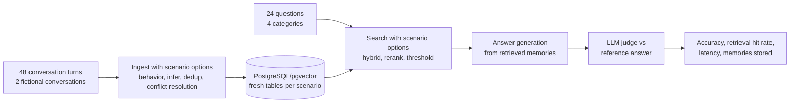

# Evaluation

The committed fixture is intentionally a small harness validation set: two
fictional conversations and 24 questions. It is useful for regression checks
and comparing configuration tradeoffs, but it is not evidence of production
benchmark performance. Generated reports identify the dataset and include
Wilson 95% question-level intervals; those intervals describe sampling
uncertainty and do not capture LLM/provider variance. Use the external
`memory-benchmarks` datasets for broader claims.

Mem0Sharp ships with a runnable evaluation harness in [evaluation/](../evaluation/README.md) that measures how well the library stores and retrieves memories across its options and memory behaviors. It uses PostgreSQL/pgvector as the database and follows the ingest → search → answer → judge pipeline used by the LOCOMO benchmark in the [Mem0 evaluation suite](https://github.com/mem0ai/memory-benchmarks), with a self-contained fictional dataset so no download is required.

## Method



Each scenario ingests the same two multi-session conversations into fresh, scenario-scoped PostgreSQL tables, then evaluates 24 questions:

| Category | Questions | What it tests |
| --- | --- | --- |
| Single-hop | 8 | Recalling one stated fact |
| Multi-hop | 6 | Combining two or more facts |
| Temporal | 4 | Reasoning about how facts changed over time |
| Adversarial | 6 | Refusing to answer questions the conversations never cover |

**Accuracy (J-score)** is the share of answers judged CORRECT by an LLM judge against a reference answer, using the LOCOMO benchmark's unified judge rules: JSON verdicts with reasoning, partial credit for list answers, paraphrase and date tolerance (±14 days, durations within 50%), and semantic-overlap matching. Adversarial questions score CORRECT only when the system declines to guess. Alongside the judge score, the harness reports the answer-quality metrics used by popular memory evaluations: **token-level F1** and **BLEU-1** between the generated and reference answers. **Retrieval hit rate** is the share of answerable questions where at least one expected evidence string appears in the retrieved memories, which separates retrieval quality from answer-generation quality.

## Scenario matrix

| Scenario | What it varies |
| --- | --- |
| `baseline` | Default pipeline: LLM extraction, hybrid search, dedup on |
| `no-hybrid` | Semantic vector search only |
| `llm-rerank` | Adds `LlmReranker` |
| `conflict-resolution` | Adds `LlmMemoryConflictResolver` (ADD/UPDATE/DELETE/NONE decisions) |
| `no-dedup` | Deduplication off |
| `infer-off` | Raw message storage, no LLM extraction |
| `strict-threshold` | Search threshold raised to 0.3 |
| `behavior-dreaming` | Dreaming memory behavior |
| `behavior-random-thoughts` | Random-thoughts memory behavior |
| `behavior-personal-memory` | First-person persona-shaped memory behavior |

## Results

### LLM-judged scenario matrix (2026-08-11)

Authoritative full run against the composed PostgreSQL/pgvector database with
`gpt-5-mini` for extraction, answering, and judging, and
`text-embedding-3-small` (1536 dimensions) for embeddings. All 10 scenarios
completed without provider errors. Behavior scenarios use an explicit behavior
filter during search so their non-normal memories are evaluated instead of
being excluded by the factual-search default.

Raw detailed reports: [Markdown](../evaluation/results/evaluation-20260811-035035.md) and [JSON](../evaluation/results/evaluation-20260811-035035.json).

| Scenario | Accuracy (J) | Mean F1 | Mean BLEU-1 | Retrieval hit rate | Memories | Mean search (ms) | Ingest (s) |
| --- | --- | --- | --- | --- | --- | --- | --- |
| baseline | 83% (20/24; 95% CI 64%-93%) | 0.48 | 0.30 | 94% (17/18; 95% CI 74%-99%) | 44 | 312 | 99.1 |
| no-hybrid | 92% (22/24; 95% CI 74%-98%) | 0.46 | 0.28 | 100% (18/18; 95% CI 82%-100%) | 49 | 305 | 111.9 |
| llm-rerank | 75% (18/24; 95% CI 55%-88%) | 0.38 | 0.21 | 94% (17/18; 95% CI 74%-99%) | 38 | 24232 | 94.2 |
| conflict-resolution | 92% (22/24; 95% CI 74%-98%) | 0.49 | 0.31 | 100% (18/18; 95% CI 82%-100%) | 39 | 373 | 163.4 |
| no-dedup | 88% (21/24; 95% CI 69%-96%) | 0.47 | 0.28 | 100% (18/18; 95% CI 82%-100%) | 43 | 351 | 110.9 |
| infer-off | 96% (23/24; 95% CI 80%-99%) | 0.54 | 0.36 | 100% (18/18; 95% CI 82%-100%) | 48 | 305 | 6.9 |
| strict-threshold | 75% (18/24; 95% CI 55%-88%) | 0.41 | 0.25 | 94% (17/18; 95% CI 74%-99%) | 40 | 305 | 107.8 |
| behavior-dreaming | 96% (23/24; 95% CI 80%-99%) | 0.44 | 0.27 | 100% (18/18; 95% CI 82%-100%) | 126 | 330 | 136.7 |
| behavior-random-thoughts | 58% (14/24; 95% CI 39%-76%) | 0.23 | 0.08 | 89% (16/18; 95% CI 67%-97%) | 98 | 327 | 141.8 |
| behavior-personal-memory | 96% (23/24; 95% CI 80%-99%) | 0.52 | 0.34 | 100% (18/18; 95% CI 82%-100%) | 58 | 318 | 147.9 |

Accuracy by category:

| Scenario | Single-hop | Multi-hop | Temporal | Adversarial |
| --- | --- | --- | --- | --- |
| baseline | 100% | 67% | 50% | 100% |
| no-hybrid | 100% | 83% | 75% | 100% |
| llm-rerank | 88% | 33% | 75% | 100% |
| conflict-resolution | 100% | 83% | 75% | 100% |
| no-dedup | 100% | 67% | 75% | 100% |
| infer-off | 100% | 100% | 75% | 100% |
| strict-threshold | 75% | 67% | 50% | 100% |
| behavior-dreaming | 100% | 100% | 75% | 100% |
| behavior-random-thoughts | 25% | 83% | 25% | 100% |
| behavior-personal-memory | 100% | 100% | 75% | 100% |

### Harness validation (2026-08-09)

The self-test run below validates the harness end to end against the composed PostgreSQL/pgvector database using the deterministic local provider (no LLM calls): 48 conversation turns were extracted, embedded, and persisted, and every answerable question retrieved at least one supporting memory.

| Scenario | Mode | Accuracy | Retrieval hit rate | Memories | Mean search (ms) |
| --- | --- | --- | --- | --- | --- |
| baseline | retrieval-only, deterministic local embeddings | n/a | 100% (18/18) | 48 | 5 |

## Reproducing and publishing results

To rerun the matrix:

```powershell
docker compose -f .\evaluation\compose.yaml up -d
Copy-Item .\evaluation\Mem0Sharp.Evaluation\evalconfig.example.yaml .\evaluation\Mem0Sharp.Evaluation\evalconfig.local.yaml
# add your API key to evalconfig.local.yaml, then:
dotnet run --project .\evaluation\Mem0Sharp.Evaluation\Mem0Sharp.Evaluation.csproj
```

To evaluate a broader or application-specific fixture, pass a JSON dataset
using the schema in
[`evaldataset.example.json`](../evaluation/Mem0Sharp.Evaluation/evaldataset.example.json):

```powershell
dotnet run --project .\evaluation\Mem0Sharp.Evaluation\Mem0Sharp.Evaluation.csproj -- --dataset .\path\to\dataset.json
```

The JSON contains a dataset `name`, `conversations` with dated sessions and
speaker turns, and `questions` with `conversationId`, `category`,
`expectedAnswer`, and `evidence`. The harness validates unique IDs and question
references before starting a database run.

The run writes Markdown and JSON reports next to the executable under `results/` (gitignored). To publish: copy both files into the committed [evaluation/results/](../evaluation/results/README.md) folder, then update the raw-report link above and the scenario summary and category tables, keeping the run date, model names, and mode from the report header. LLM extraction and judging are not perfectly deterministic; rerun before drawing conclusions from small differences.

## Interpreting the measured results

- **Adversarial accuracy is 100% in every scenario**. With retrieval scoped correctly, Mem0Sharp declines to answer questions the conversations never covered instead of hallucinating.
- **`infer-off`, `behavior-dreaming`, and `behavior-personal-memory` share the top score at 96%**. `infer-off` is the fastest ingest path at 6.9 seconds and preserves full conversation context; dreaming stores the richest associative set at 126 memories; personal memory reaches the highest F1 at 0.52 among the behavior scenarios.
- **The behavior-aware search correction matters**. The first run produced 0% retrieval for all non-normal behaviors because the evaluator used the factual-only default. The authoritative run explicitly selects each scenario behavior, restoring retrieval to 100% for dreaming and personal memory and 89% for random thoughts.
- **`random-thoughts` remains the weakest factual-recall behavior** at 58% accuracy and 0.23 F1. Its 89% retrieval hit rate shows that the main loss is answer quality and associative dilution, not complete retrieval failure; use it for ideation rather than factual recall.
- **`no-hybrid` performed well in this run** at 92% accuracy and 100% retrieval hit rate, but this small fixture is not enough to conclude that keyword fusion is unnecessary. Hybrid search remains the safer default for exact names, places, and phrases.
- **`llm-rerank` did not pay off here**: it took 24.2 seconds per question set and reached 75% accuracy, lower than baseline. Keep reranking for larger candidate pools where vector order is demonstrably noisy.
- **`strict-threshold` (0.3) reduced accuracy to 75% and retrieval to 94%**, while the default threshold retained 94% retrieval. Treat 0.3 as a workload-specific setting rather than a general default.
- **Temporal reasoning remains difficult**, ranging from 50% to 75% for most scenarios. The small sample and wide confidence intervals mean these category differences should be treated as directional rather than definitive.
